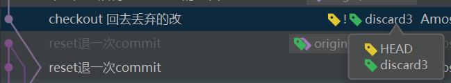
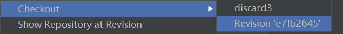
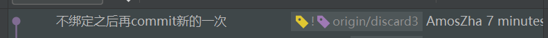

### git基础

### add commit 本质

#### add 本质：

将工作目录文件复制到index树

#### commit 本质：

将index树文件复制到head树.

#### reset 本质(不带路径：非文件级别，commit级别的)：

reset --soft [commit]

将head和当前分支的指向移动到某个commit（从IDE看，同时移动head和分支名标签）

如果历史移动一个版本之后，最后一个版本无法用git log找到，IDE的图形树里面也会不显示（手动切过去能显示），相当于丢弃后面的commit ***最后一个版本的commit如果之前没有push，之后也不会存到远端，重新克隆代码拿不到！！！*** 。

要用git reflog--查询本地日志才能找到（但是，因为不会提交，本地文件删了就没了，重新克隆代码拿不到！）

被如此丢弃的commit只会在本地，无法push到远端，因为他只有head标签，没有分支指向标签（不属于任何分支）。

(想要checkout到分支上本分支指向的commit，这种情况再用reset + commit版本号将分支指向移动到废弃的分支是行不通的，只会把head移动过来，分支指向移动不过来。)

可以为这个丢弃的commit新建分支: git branch \<new-branch-name\> [commit]，建完之后IED上会多一个新分支的标签，
但此时[detached HEAD e7fb264]，head在某个commit上，不是在某个分支，IDE的head标签和分支指针标签之间有个感叹号。

head指向某个commit，新分支也指向这个commit，但是head和新分支没有连起来，无法push。

***checkout 分支名可以将head和分支标签中间的感叹号去掉*** ，
即将head和分支指针绑在一起，然后可以正常push了。（其实这种情况，在IDE中右击分支，选checkout之后，也会给到分支名和commit编号两个选项）

如果不用checkout 分支名，不连接，用git push origin \<new-branch-name\> 也能提交到新分支，
但是IDE的head标签和分支指针标签之间感叹号还在，之后的开发，commit之后head会前进，分支指向不会前进，
再这样push origin就没用了， 

如果不理睬，直接push origin HEAD:新分支名。
看上去没有报错，但其实是将新分支指向位置再推到远端，并不是当前head处新改的地方，
之前分支已经推过了，所以再推一次的话，其实这次什么都没推到远端，显示文件已经都更新了。

只能用git push origin HEAD:新分支名强行push到远端，而且之后的commit也都要这样push，新分支指针都不会跟上来，并且head和远端分支之间也有感叹号。

所以，还是要用checkout+分支名（而不是+commit号）把head链接分支指向，之间的感叹号会消失。head和分支指向绑定了，之后可以正常push了。

### 解决冲突

当当前要push的版本在远端版本之前时，会提示先pull。

pull的时候如果有无法自动解决的冲突，会提示merge，文件会被加上箭头等符号，处理冲突文件修改成要的样子，保存，add，commit，push

### git add
新建文件之后需要add，然后commit才会将新建的文件提交上去。

修改文件和新建一样，修改之后必须add，提交的时候才会提交变化。

否则commit，push完了，在ide中，状态还是修改过的蓝色。
同时commit完git status 还是能看到那个修改未提交的文件提示（只commit不push就可以看到）

git add . // add所有文件

### git push

如果有多次commit未push，执行git push命令会把多条一起push上去

### .gitignore

想要让git status命令不显示.idea文件夹未被跟踪，项目更目录添加.gitignore文件，内容添加.idea/

然后，commit之后就能提示"nothing to commit, working tree clean"，而不是有文件未被跟踪。

### HEAD

在Git中，用HEAD表示当前版本，上一个版本就是HEAD^，上上一个版本就是HEAD^^，当然往上100个版本HEAD~100。

在windows的cmd控制台下操作git，想要回滚到上一次提交，但是输入git reset --hard HEAD^后就显示more?

这是因为cmd控制台中换行符默认是^，而不是\ ，所以它的more？的意思是问你下一行是否需要再输入，而^ 符号就被当做换行符而被git命令忽略掉了。

解决方法有如下几种：

git reset --hard "HEAD^"   //加引号

git reset --hard HEAD^^  //加一个^

git reset --hard HEAD~ 或者 git reset --hard HEAD~1  //把^换成~，~ 后面的数字表示回退几次提交，默认是一次

### git reset 

git reset "HEAD^" // head 切回上个版本。
git reset 版本哈希或者哈希前8位 // head 切回指定版本。可以一直切着玩，最后切回去。

master 和 HEAD标签都会退到倒数第二个commit，origin/master还在最后一次。

#### 剔除已add的文件

不小心多add文件，可以用git reset 文件名，把文件从暂存区（即add内容中剔除，这个文件回到add之前状态）

### reset 和 checkout 区别

#### 不带路径

运行 git checkout [branch] 与运行 git reset --hard [branch] 非常相似，它会更新所有三棵树使其看起来像 [branch]，不过有两点重要的区别。

首先不同于 reset --hard，checkout 对工作目录是安全的，它会通过检查来确保不会将已更改的文件弄丢。 其实它还更聪明一些。它会在工作目录中先试着简单合并一下，这样所有 还未修改过的 文件都会被更新。 而 reset --hard 则会不做检查就全面地替换所有东西。

第二个重要的区别是 checkout 如何更新 HEAD。 reset 会移动 HEAD 分支的指向，而 checkout 只会移动 HEAD 自身来指向另一个分支。

例如，假设我们有 master 和 develop 分支，它们分别指向不同的提交；我们现在在 develop 上（所以 HEAD 指向它）。 如果我们运行 git reset master，那么 develop 自身现在会和 master 指向同一个提交。 而如果我们运行 git checkout master 的话，develop 不会移动，HEAD 自身会移动。 现在 HEAD 将会指向 master。

所以，虽然在这两种情况下我们都移动 HEAD 使其指向了提交 A，但 做法 是非常不同的。 reset 会移动 HEAD 分支的指向，而 checkout 则移动 HEAD 自身。

原文： https://git-scm.com/book/zh/v2/Git-%E5%B7%A5%E5%85%B7-%E9%87%8D%E7%BD%AE%E6%8F%AD%E5%AF%86

#### 带路径

运行 checkout 的另一种方式就是指定一个文件路径，这会像 reset 一样不会移动 HEAD。 它就像 git reset [branch] file 那样用该次提交中的那个文件来更新索引，但是它也会覆盖工作目录中对应的文件。 它就像是 git reset --hard [branch] file（如果 reset 允许你这样运行的话）， 这样对工作目录并不安全，它也不会移动 HEAD。

此外，同 git reset 和 git add 一样，checkout 也接受一个 --patch 选项，允许你根据选择一块一块地恢复文件内容。

总结表

下面的速查表列出了命令对树的影响。 “HEAD” 一列中的 “REF” 表示该命令移动了 HEAD 指向的分支引用，而 “HEAD” 则表示只移动了 HEAD 自身。 特别注意 WD Safe? 一列——如果它标记为 NO，工作目录未提交内容会丢失。

| Commit Level  | HEAD           | index  | Workdir| WD Safe? |
| :------------:|:-------------:|:-----:|:-----:|:-----:|
| **reset --soft [commit]** | REF | NO | NO | YES |
| **reset [commit]**        | REF      |   YES | NO | YES |
| **reset --hard [commit]** | REF | YES | YES | NO |
| **checkout \<paths\>**     | HEAD    |   YES | YES | YES |

| File Level  | HEAD           | index  | Workdir| WD Safe? |
| :------------:|:-------------:|:-----:|:-----:|:-----:|
| **reset [commit] \<paths\>** | NO | YES | NO | YES |
| **checkout [commit] \<paths\>**        | NO  |   YES | YES | NO |

