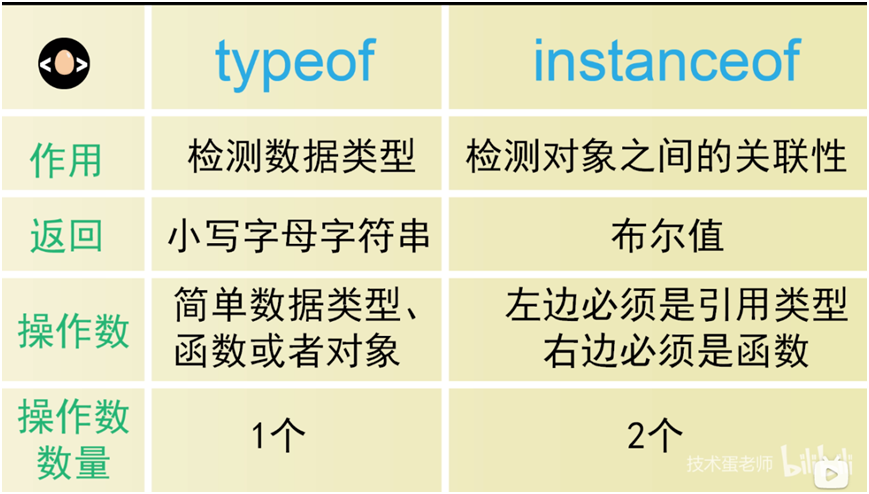

## 数据类型判断

### 数据类型判断

Instance of & type of Instance of 操作符左边一定要是实例，如果是基本类型直接返回false。检测对象之间的关联，a是否是b的实例。

```js
new Number(888) instanceof Number // true
888 instanceof Number // false

```

用new 创建的数组 字符串 数字都是引用类型，可以用instance of

[comment]: <> (![An image]&#40;./img1.png&#41;)

[comment]: <> ()

| 对比        | typeof           | instanceof  |
| :-------------:|:-------------:| :-----:|
| **作用**    | 监测数据类型 | 检测对象的关联性 |
| **返回**      | 小写字母字符串      |   布尔值 |
| **操作数** | 简单数据类型、<br/>函数或者对象 | 左边必须是引用类型</br>右边必须是函数 |
| **操作数数量** | 1个      |    2个 |

[comment]: <> (## 数据类型判断2)
