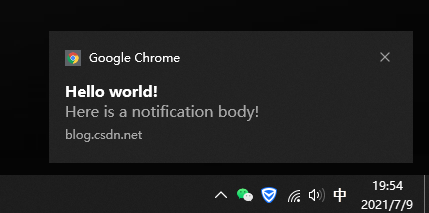

## window

### 禁止alert

```js
window.alert = function() {
  return false
}
```

### Progressive Web Apps PWA

浏览器在浏览器之外，推送操作的通知

```js
//检查是否支持
if ('Notification' in window && navigator.serviceWorker) {
  // Display the UI to let the user toggle notifications
}
//检查权限
if (Notification.permission === "granted") {
  /* do our magic */
} else if (Notification.permission === "blocked") {
  //用户拒绝推送 
} else {
  //显示提示
}
```

```js
function displayNotification () {
  if (Notification.permission == 'granted') {
    navigator.serviceWorker.getRegistration().then(function (reg) {
      var options = {
        body: 'Here is a notification body!',//主体内容
        icon: 'images/example.png', // 通知图标
        vibrate: [100, 50, 100], //震动，先100ms然后暂停50ms最后在震动100ms
        data: {//通知数据，用于人机交互
          dateOfArrival: Date.now(),
          primaryKey: 1
        }
      }
      reg.showNotification('Hello world!', options) // 弹出通知命令
    })
  }
}
```

 


```js
//监听关闭通知事件，比如安卓上面滑动通知关闭。
self.addEventListener('notificationclose', function(e) {
  var notification = e.notification
  var primaryKey = notification.data.primaryKey
  console.log('Closed notification: ' + primaryKey)
})

//监听通知的点击事件
self.addEventListener('notificationclick', function(e) {
  var notification = e.notification
  var primaryKey = notification.data.primaryKey
  var action = e.action

  if (action === 'close') {
    notification.close() // 点关闭通知就关闭通知
  } else {
    clients.openWindow('http://www.example.com') // 这里试过，能打开，但是是本网站的根目录，有待研究
    notification.close() // 点其他地方，先打开网站，再关闭通知
  }
})
```